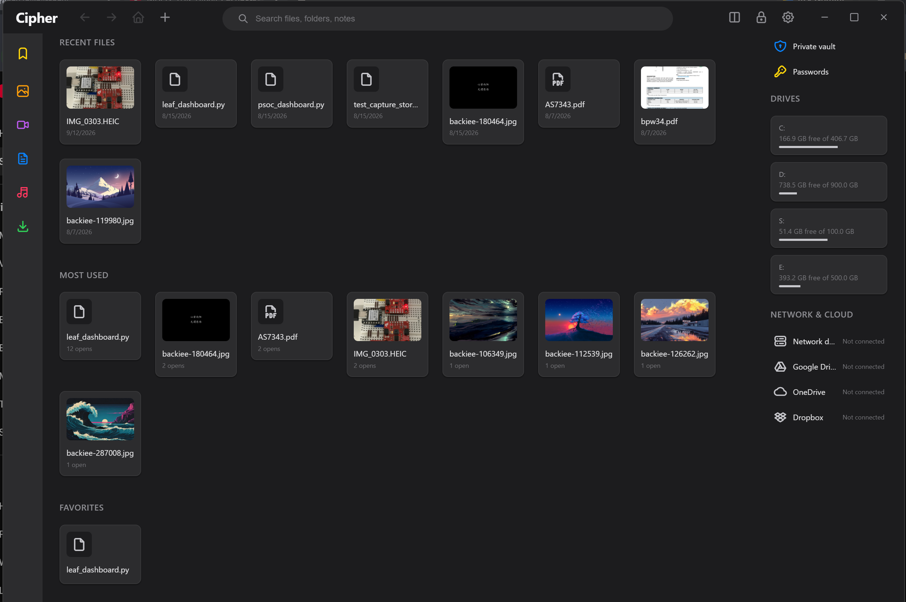
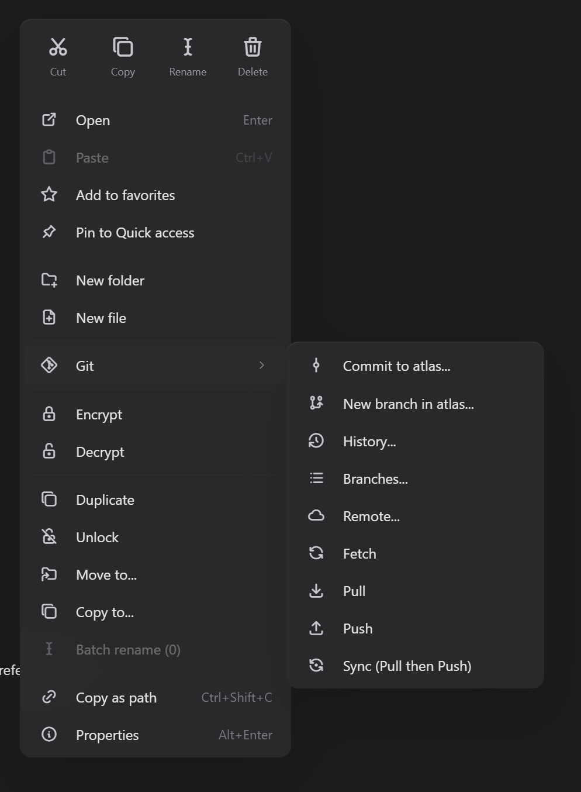
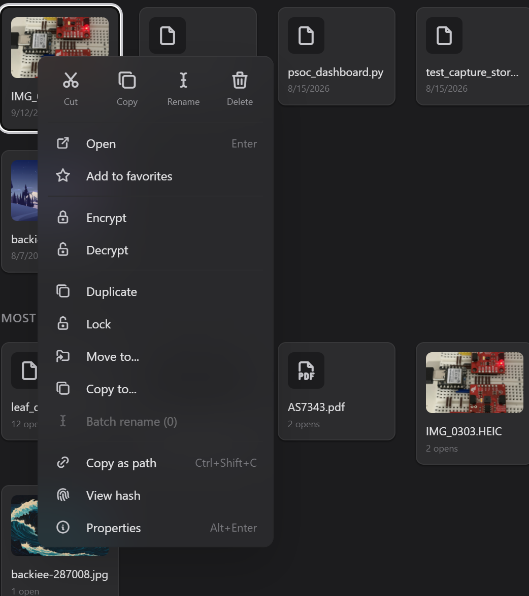
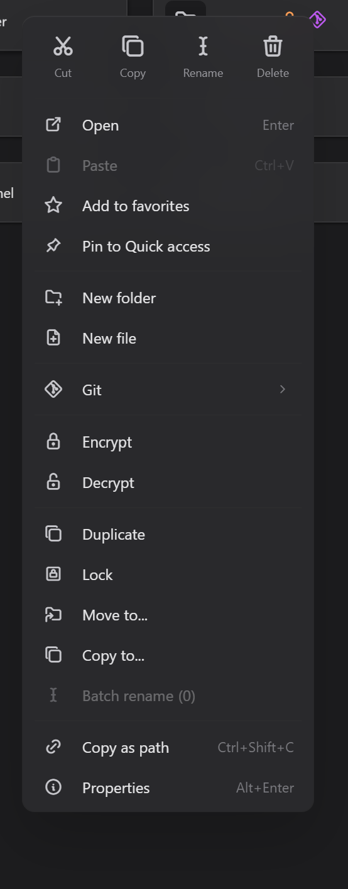
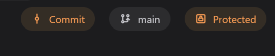
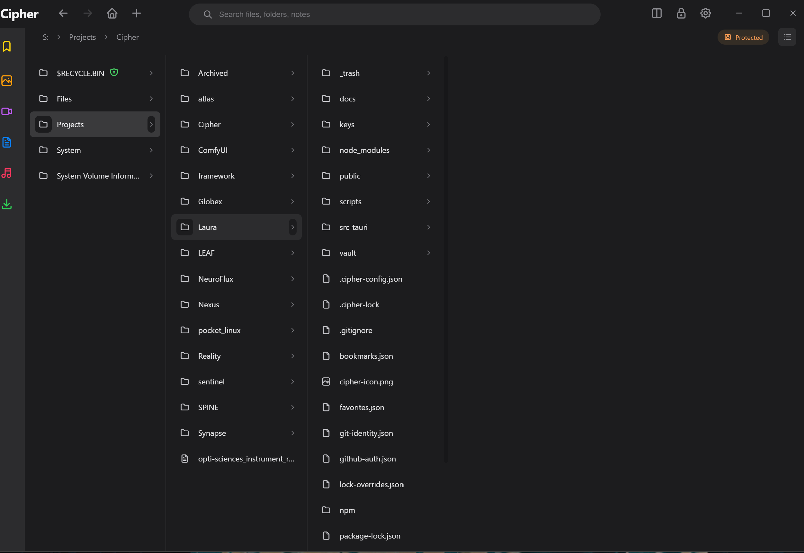
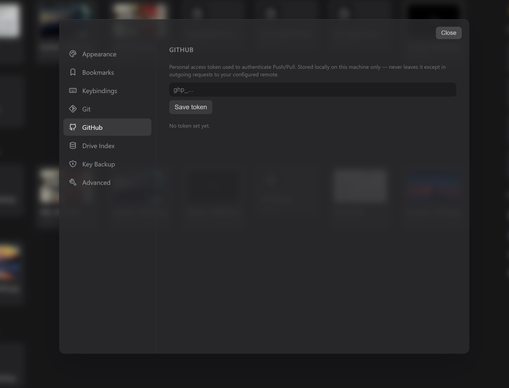
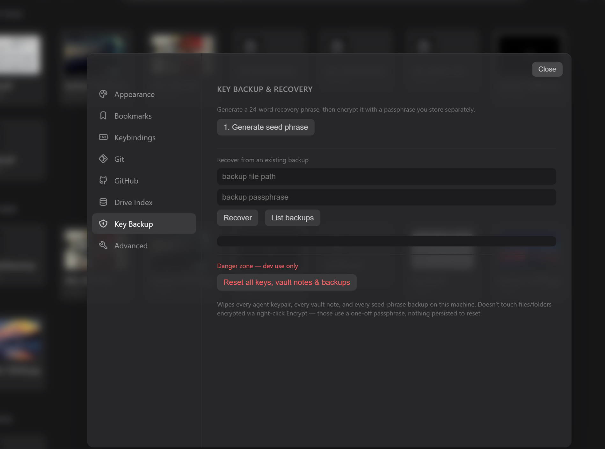

# Cipher

**A native Windows file explorer with a built-in encrypted knowledge vault, live full-drive search, and real Git sync — one desktop app, zero cloud dependency.**

Built with [Tauri 2](https://tauri.app) (Rust backend, no Electron/Chromium bundle) and a single-file HTML/CSS/JS frontend, styled on Apple's Human Interface Guidelines. Everything lives on your disk. Nothing phones home.


*Home dashboard — recent files, most used, favorites, live drive space, and Network & Cloud status.*

---

## ✨ What makes it different

Most file explorers just move bytes around. Cipher treats your filesystem as something worth protecting, searching instantly, and version-controlling — not just browsing.

- 🔐 **Real encryption, not a password on a zip.** Right-click Encrypt/Decrypt on any file or folder (recursive), backed by XChaCha20Poly1305 content encryption and Argon2id key derivation. Encrypted items get visible badges everywhere — browser rows, parent folders containing encrypted content several levels down, home cards, search results.
- 🔑 **Audited public-key cryptography under the hood.** Per-agent identity uses X25519 via `crypto_box` — a Cure53-audited crate — with per-recipient envelope wrapping, the architectural groundwork for genuine multi-party access control rather than one shared password.
- 🧬 **24-word seed phrase key backup.** BIP39-style recovery phrase, encrypted with a separate passphrase, full generate → write-down → encrypt → recover flow. Lose your device, not your vault.
- ⚡ **Instant, live, whole-drive search.** A SQLite index covers every drive you choose to index (2.4M+ files tested across 4 drives), with an optional live filesystem watcher keeping it current — no cloud indexing, no waiting.
- 🔀 **Real Git integration, not "save a copy."** Full local repo lifecycle, GitHub push/pull over HTTPS with PAT auth, and genuine 3-way merge conflict resolution — detect, diff, and resolve (keep local / use remote / keep both) per file, right from the same context menu you already use for file ops. Live-tested end-to-end against a real GitHub repo, including an actual resolved merge conflict.
- 🔒 **Folder-level write protection.** Lock any folder — and everything inside it — against writes, with per-path override exceptions when one file needs to stay writable without unlocking the whole tree.
- 🚫 **Configurable extension blacklist.** Blocks creation of dangerous file types (`.exe`, `.bat`, `.ps1`, `.vbs`, `.scr`, `.lnk`, and more) at the file-operation level.
- 🖼️ **Real thumbnails, not a generic icon.** Native Rust generation for images, HEIC/HEIF, and PDF (first page), with persistent disk caching keyed to path + size + modified time. Video thumbnails are feature-gated behind FFmpeg since that build path is genuinely fragile on Windows — off by default so a bad FFmpeg setup can never break the rest of the app.
- 🗑️ **Recycle-bin-safe deletes.** Nothing vanishes by accident — deletions go through the OS trash, not `rm -rf`.
- 🎛️ **A file browser built for daily driving, not a demo.** Four view modes (list, grid, Finder-style column view, compact tile), multi-tab, browse-only split pane, breadcrumb with per-segment dropdowns, full keyboard navigation, remappable keybindings, batch rename with pattern tokens, undo/redo, and a Spotlight-style command palette (Ctrl+K) searching commands, settings, folders, the file index, and vault notes in parallel.
- 🪶 **Genuinely lightweight.** A Tauri shell means a native Rust binary plus the OS's own WebView2 — not a bundled Chromium instance.


*Folder-level write protection — the whole "Cipher" project folder locked, individual files showing lock badges.*

---

## 🖱️ Everything lives in one right-click menu

No separate panels to hunt through. File ops, encryption, locking, and full Git — all from the same context menu, contextual to whatever you clicked.

<table>
<tr><td></td><td></td></tr>
<tr><td align="center"><em>File: Open, favorite, Encrypt/Decrypt, Duplicate, Lock, Move/Copy to, hash, properties</em></td><td align="center"><em>Folder adds New folder/file and a <b>Git ▸</b> flyout — Cipher only shows Git actions where a repo makes sense</em></td></tr>
</table>

The Git flyout is repo-aware: on an unversioned folder it offers to init a repo in place; on an existing repo it expands to Commit, New branch, History, Branches, Remote, Fetch, Pull, Push, and Sync (pull then push) — all scoped to that folder, labeled with the repo's own name.

Once a folder's under Git, the toolbar shows two live status pills next to the breadcrumb:


*Commit pill (amber = uncommitted changes, click to commit directly), current branch, and a lock-status pill — all live, updating as you work.*


*Column view showing Cipher's own repo, entirely write-locked — every item carries a lock badge, and the toolbar shows "Protected."*

---

## 🧱 Tech stack

| Layer | Technology |
|---|---|
| Shell / runtime | [Tauri 2](https://tauri.app) |
| Backend | Rust |
| Frontend | Vanilla HTML/CSS/JS, single file, no build step |
| Vault crypto | `crypto_box` (X25519 + SalsaBox, Cure53-audited), `chacha20poly1305` (XChaCha20Poly1305), `argon2` (Argon2id) |
| Key backup crypto | `aes-gcm`, `pbkdf2` (480k iterations), BIP39-style 24-word seed phrases |
| Search index | SQLite (`rusqlite`) + `notify` for live filesystem watching |
| Git sync | `git2` (libgit2 bindings), full merge/conflict machinery |
| Media | `image`, `heic`, `pdfium-render`, optional `ffmpeg-next` (video thumbnails, feature-gated) |
| File safety | `trash` (Recycle Bin–backed delete) |

---

## 🚀 Getting started

### Prerequisites
- [Rust](https://rustup.rs/) (stable toolchain)
- [Node.js](https://nodejs.org/) + npm
- Platform build tools for Tauri — see the [Tauri prerequisites guide](https://tauri.app/start/prerequisites/)

### Run in development
```bash
npm install
npm run tauri dev
```

### Build a release binary
```bash
npm run tauri build
```
Output (MSI + NSIS installers, confirmed working) lands in `src-tauri/target/release/bundle/`.

### Optional: enable video thumbnails
Off by default because FFmpeg's Windows build path is genuinely fragile. To turn it on:
```bash
winget install "FFmpeg (Shared)"
# set FFMPEG_DIR to the install path, then:
cd src-tauri
cargo build --features video-thumbnails
```

---

## 📁 Project structure

```
Cipher/
├── public/              # Frontend — single-page HTML/CSS/JS, no build step
├── src-tauri/
│   ├── src/               # Rust backend — vault, crypto, search, git sync, file ops, restrictions
│   ├── capabilities/       # Tauri permission scopes
│   ├── icons/              # App icons (all platforms)
│   └── tauri.conf.json     # Tauri app configuration
├── scripts/                # Launch helpers and dev/scaffolding scripts
├── assets/                 # README images
└── docs/                   # Architecture notes and integration docs (not tracked in git)
```

---

## ⚙️ Settings

Everything configurable lives in one sidebar + content-pane Settings panel:

| Category | Covers |
|---|---|
| Appearance | Dark mode, grid overlay + cell size for pixel-precise layout work |
| Bookmarks | Configurable storage location |
| Keybindings | Every shortcut is remappable — click, press the new combo, done |
| Git | Author identity (name + email) used for every commit |
| GitHub | Personal access token for push/pull, stored locally only |
| Drive Index | Pick which drives to index, live file-watcher toggle per drive |
| Key Backup | Seed phrase generation/recovery, plus a dev-only "reset all keys, notes & backups" switch |
| Advanced | GPU/WebGL diagnostics, cache clearing, native vault crypto test harness |

<table>
<tr><td></td><td></td></tr>
<tr><td align="center"><em>Per-drive indexing with live file-watch toggles</em></td><td align="center"><em>24-word seed phrase backup & recovery</em></td></tr>
</table>

---

## 🛣️ Roadmap

Cipher is built in phases; most of the core is done and live-tested. What's shipped, and what's next:

**✅ Shipped:** core file operations (cut/copy/paste/rename/delete/batch-rename/undo-redo), folder write locks + extension blacklist, manual per-file/folder encryption with visual badges, 24-word key backup & recovery, full Git integration with real conflict resolution, live drive indexing with filename + type search, home dashboard, image/HEIC/PDF thumbnails, four browser view modes, multi-tab, split pane, Spotlight-style command palette, remappable keybindings, full accessibility pass (keyboard nav, focus rings, WCAG contrast).

**🚧 In progress / partial:**
- Video thumbnails (built, feature-gated behind a fragile FFmpeg Windows build — off by default)
- Settings coverage (Git/GitHub/Drive Index/Key Backup done; general/storage/theme-switch panels still open)

**📋 Planned:**
- Transparent encryption-on-write (today's Encrypt/Decrypt is a manual per-item action, not an always-on layer)
- Private vault as a dedicated, genuinely isolated user folder (currently opens Settings)
- Auto-lock timeout for the vault
- Auto-watch + auto-commit-on-write for Git, with per-commit metadata (agent ID, session, file hash)
- Full-text content search (SQLite FTS5) and semantic search (LanceDB/Chroma embeddings)
- Date-range and size-range search filters
- Storage summary (pie chart by folder) and quick-stats card on the home dashboard
- Tree view, details/preview sidebar, editable path bar (Ctrl+L), go-to-path (Ctrl+G)
- Document thumbnails (Word/Excel/PPT/Markdown), image lightbox, in-app PDF viewer
- Multi-agent vault sharing — the X25519 envelope-encryption architecture already supports per-recipient key wrapping; exposing it end-to-end through the UI (today's vault is single-agent) is the next major vault milestone
- Linux port (WebKitGTK)

Deliberately parked, not forgotten: a dedicated Fork/VS Code-style Git panel (current right-click-menu approach fits Cipher's file-browser-first design better for now), D3-force graph visualization of vault notes, and a FUSE virtual filesystem layer for Linux.

---

## 📄 License

*(add your chosen license here — e.g. MIT)*
